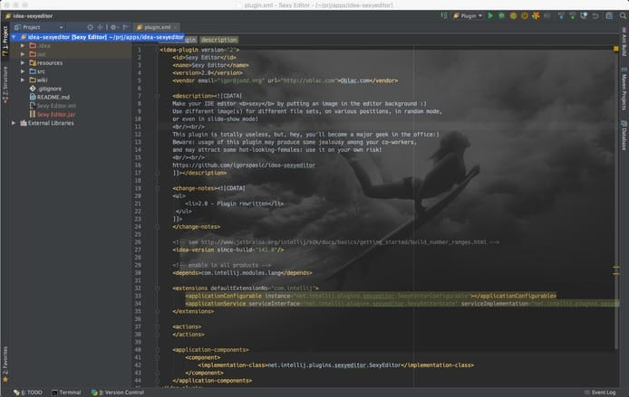

# IntelliJ Sexy Editor ❤️💻

<!-- Plugin description -->
**Level up your editors with awesome backgrounds!**

Editors are so boring. White background. Black background. Choose-your-color background. Meh.

Not anymore! With **Sexy Editor**, your JetBrains IDE becomes _awesome_! Choose one or more background images and your everyday editor gets transformed into _visual masterpiece_.

But wait, there's more! It's not just about a visually stunning image. Infuse it with a motivational quote of your choosing! By glancing at it every hour, throughout your workday, you'll gradually transform into the very embodiment of your aspirations!

<!-- Plugin description end -->

**Be a unicorn 🦄 and [vote for the plugin](https://plugins.jetbrains.com/plugin/1833-sexy-editor) to increase your karma 🔮!**

## Features

+ Assign backgrounds to various editors (just editor (!), not the complete UI).
+ Use random mode to shuffle images on open.
+ Slideshow mode changes background image while you work.
+ Control opacity of the background image.
+ Set background image position and size.
+ Scroll image together with the code.
+ Various fitting options.

## Links

+ [Usage](doc/Usage.md)
+ [Example: Gallery](doc/ExampleGallery.md)
+ [Example: Keymap](doc/ExampleKeymap.md)
+ [Example: Types](doc/ExampleTypes.md)

# Success Stories

Over time, we have received a large amount of beautiful feedback on how `Sexy Editor` changed people lives. Here are just few.

> "I was just a junior developer in this high-end, enterprise, company. No one really listened to my ideas, they just delegated the most boring tasks to me. Until one day, the principal consultant saw my IntelliJ IDEA opened. He came to my place and asked about the plugin... and a month later, I was promoted and started working directly for the consultant. Guys, thank you so much." - Greg, New York, USA

> "I had a huge crush on our new internship guy. I put his image as a background, I was really in love. One day he saw his image beyond my Java code. He liked both the code and the plugin. Year later we got our first kid. He was named Ed, in honor of Sexy Editor." - Jacqueline, Paris, France

> "I stopped smoking thanx to you guys! I spent like hundreds of dollars for all kind of California therapists, and nothing helped. I was despaired. Then I just made a pic with simple sentence: I am not smoking. That was it. I guess my brain processed this message even I was not directly looking at it. Two months later, I was a new guy!" - Brian, San Francisco, USA

> "Everyone in my office wants to figure the secret how I made my IDEA so beautiful. I am not telling them, ha ha... And I love this feeling!" - Anonymous
