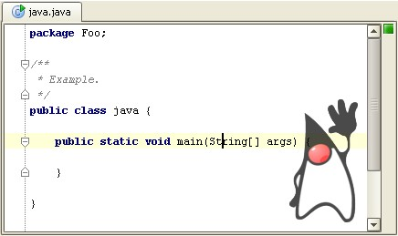

# Awesome Editor Examples

🚀 Just a few ideas to start you up!

## Background Gallery

Add all your preferred images to the `file list` and activate the `slideshow` feature. Perfect for individuals who spend long hours on IDEA. Have fun!

Turn off the `slideshow` if it becomes too distracting; just enable the `random` flag instead: every time the new file is edited, a random background will be used.

(In the example: images are aligned to the middle-right edge and opacity is set to 20%.)

## Background per file type

Have each file type its own background! For example, we can put little Duke in a bottom-right corner for all Java files (`*.java`):

(In this example the Duke image is a PNG image with a transparent background. Therefore, `opacity` of the image may be high, e.g., `80%` - `100%`.)

## IDEA Keymap

Since the right part of the editor is often unused, we can add an image with the most important keymaps to it:

For example, we can take the default IDEA keymap reference and export an image for each column. Put these images in the `file list` and turn on the `slideshow`.