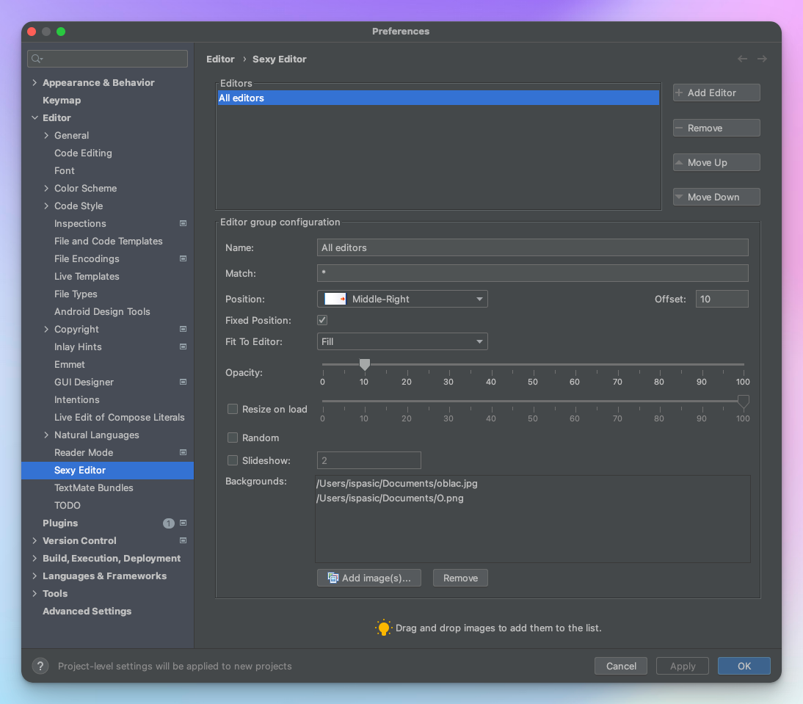

# Usage

## Configuration screen

## Editor

`Editors` is a list of editor groups. Each group is defined by its _name_ and files matching _wildcard patterns_. Order of the groups is important: it goes from top to bottom. Editors' file name is matched upon each group starting from the top of the list.

## Name and Match

`Name` is just user-friendly label. `Match` is semi-column (;) separated list of _wildcard_ (no regex) file patterns that defines which files will be associated with currently selected group.

## Position and Offset

Images' relative position in the editor window. `Offset` is a gap in pixels between image and nearest editors' edge.

## Fixed position

If checked, background image will not follow scrolling of the editor.

## Fit to editor

Various fitting strategies, on how background image is resized for the editor size.

## Opacity

Controls the image transparency.

## Resize on load (adv.)

If this option is set, large images will be resized to fit the _desktop_ size. Note it is a desktop size, not IDEA size, therefore, images will be still a bit larger than editor. 100% means images will fit to desktop, 50% means images will fit the one quarter of the screen.

Once again, this is not a simple resizing of the images. This is a definition of the max image size relative to OS display. The small images stay the same, large images gets shrinked.

## Random

Enables the random mode, where next background image is chosen randomly from the file list.

## Slideshow

Slideshow enables image changes in runtime, during user work. Value defines number of seconds between image change.

## Backgrounds

List of all images. Each file has to be in one row. Invalid files are simply ignored. Supports drag-and-drop.